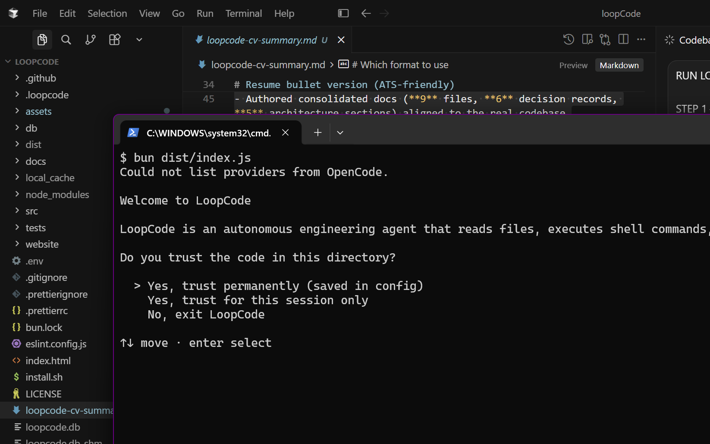
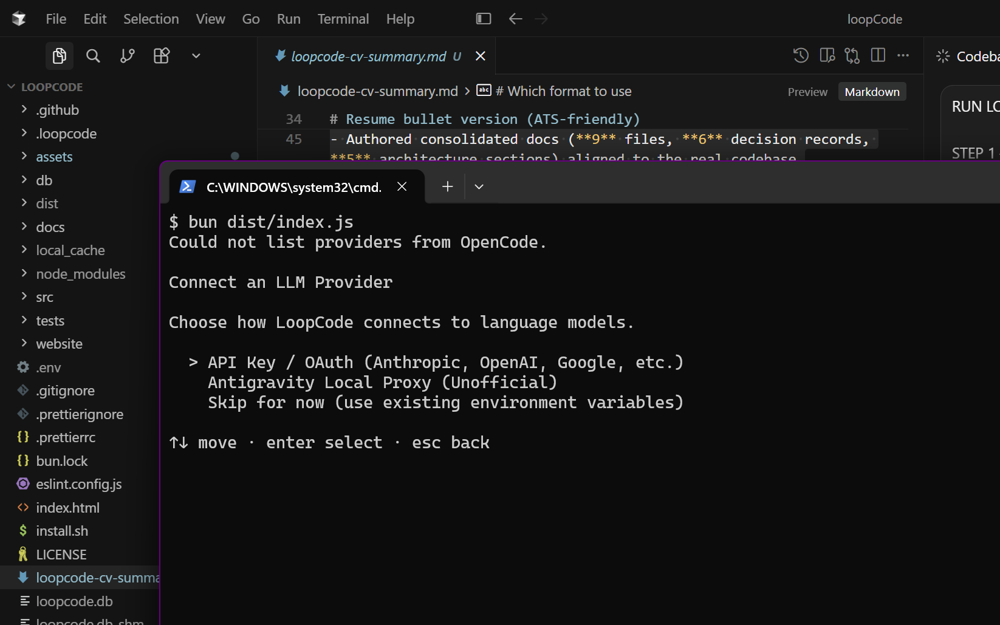
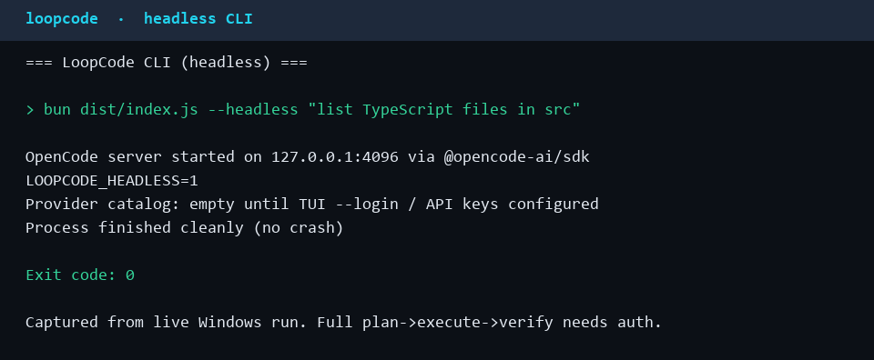

# LoopCode

**AI-powered code planning, execution, and verification orchestrator.**

Autonomous coding agent that plans goals, executes via OpenCode, verifies output, budgets costs, and routes repairs — all via a Bun/TypeScript CLI + TUI with SQLite session memory.


**Repository:** [sumandey7684/loopcode](https://github.com/sumandey7684/loopcode) · **Docs:** [docs/README.md](docs/README.md)

> Not affiliated with, sponsored by, or endorsed by the OpenCode/Anomaly team.

---

## What it does

LoopCode orchestrates multi-turn AI software engineering with verification, budgets, and a local-first control plane:

| Feature             | Status                                                        |
| ------------------- | ------------------------------------------------------------- |
| **Goal planning**   | ✓ Natural language → DAG plan (`Classifier` + `PlannerAgent`) |
| **Code execution**  | ✓ Via `@opencode-ai/sdk` (OpenCode server sessions)           |
| **Verification**    | ✓ `VerifierAgent` (+ legacy `Verifier` fallback)              |
| **Cost budgeting**  | ✓ Monthly / goal / task caps → exit `77`                      |
| **Loop safety**     | ✓ Oscillation detection + approval modes                      |
| **Session resume**  | ✓ SQLite tasks/sessions across restarts                       |
| **Interactive TUI** | ✓ Ink transcript UI + overlays                                |
| **Headless CLI**    | ✓ `--headless` for CI / automation                            |

---

## Quick start

### Prerequisites

- **Bun** 1.0+ ([install](https://bun.sh))
- **OpenCode** available to `@opencode-ai/sdk` (local server)
- **Git** (worktree scheduling)

### Setup (~60 seconds)

```bash
git clone https://github.com/sumandey7684/loopcode.git
cd loopcode
bun install
bun run build
```

### Environment

Create a local `.env` (gitignored) for the OpenCode server password:

```env
OPENCODE_SERVER_PASSWORD=your_dev_password
```

Optional LoopCode overrides (also supported via `~/.loopcode/config.toml` — see [docs/CONFIG.md](docs/CONFIG.md)):

```env
LOOPCODE_MAX_MONTHLY_USD=100
LOOPCODE_MAX_GOAL_USD=10
LOOPCODE_MAX_TASK_USD=2
LOOPCODE_MODEL=anthropic/claude-sonnet-4-6
LOOPCODE_ASCII=1
```

Provider API keys / OAuth are configured through the TUI (`--login` or `/login`), not hardcoded in the repo.

### Run

**Interactive TUI**

```bash
bun run tui:dev
# or: bun run src/index.ts "Add a user profile endpoint"
```

**Headless CLI**

```bash
bun run cli:dev
# or: bun run src/index.ts --headless "Fix the failing auth test"
```

**Tests**

```bash
bun run test          # 113 passing / 115 total (98.3%); 2 known failing orchestrator tests
bun run test:watch    # Watch mode
```

---

## Current Status

**Functional MVP — production hardening in progress.**

| Area | State |
| --- | --- |
| Core orchestration | Functional (`plan → execute → verify → replan`) |
| Agents | 5 modules: planner, engineer, reviewer, verifier, base |
| CLI / TUI | Functional (Ink interactive + `--headless`) |
| SQLite session persistence | Implemented |
| Verification | Implemented (`VerifierAgent` + legacy fallback; integration/lint layers incomplete — see [docs/TASKS.md](docs/TASKS.md)) |
| Cost / loop safety | Implemented (budget caps, oscillation detection) |
| Automated tests | **113 passing / 115 total** (98.3% pass rate) |
| Known failing tests | **2** orchestrator retry/replan tests |
| Live LLM / OpenCode E2E | Requires configured provider authentication (not claimed verified here) |
| CI | Ubuntu + macOS (Windows exercised locally; not in CI matrix) |

**Debt / TODO:** [docs/TASKS.md](docs/TASKS.md#debt--)

---

## Live Demo

### Interactive TUI



*Session initialization with trust/permission gate*

### TUI Provider Setup



*Provider configuration menu (API key, OAuth, or local proxy)*

### Headless CLI



*Command-line mode with OpenCode server (requires auth to run full plan→execute→verify)*

**Note:** Full goal orchestration requires a configured LLM provider (OpenAI, Anthropic, Google, or Antigravity local proxy). Screenshots show UI flow; cost/verification demo pending auth.

---

## Architecture

**Core modules**

| Piece           | Path                       | Role                                                         |
| --------------- | -------------------------- | ------------------------------------------------------------ |
| Orchestrator    | `src/orchestrator.ts`      | Plan → execute → verify → replan loop                        |
| Agents          | `src/agents/`              | Planner, engineer, reviewer, verifier                    |
| Memory / DB     | `src/memory/`, `src/db/`   | SQLite schema, shared agent IR, sessions                     |
| CLI / TUI       | `src/cli/`                 | Ink UI, approvals, trust gate                                |
| Safety / cost   | `src/safety/`, `src/cost/` | Loop detector, budget hard-stop                              |
| Router          | `src/router/`              | Dynamic model routing (+ unused portfolio)                   |
| OpenCode bridge | `src/opencode.ts`          | SDK client / session execution                               |

**Data flow**

```
User goal (TUI/CLI)
  → Classifier / PlannerAgent
  → EngineerAgent + OpenCode sessions (worktree batches)
  → VerifierAgent (compile → test → security → review)
  → CostEngine + EventBus → SQLite session memory
```

**Full map:** [docs/ARCHITECTURE.md](docs/ARCHITECTURE.md)

---

## Documentation

Everything lives under [`docs/`](docs/README.md):

| Doc                                     | Purpose                                |
| --------------------------------------- | -------------------------------------- |
| [PROJECT.md](docs/PROJECT.md)           | Problem, features, requirements        |
| [ARCHITECTURE.md](docs/ARCHITECTURE.md) | Layers, modules, dependency graph      |
| [AGENTS.md](docs/AGENTS.md)             | State machine, EventBus, safety        |
| [VERIFICATION.md](docs/VERIFICATION.md) | `VerifierAgent` layer flow             |
| [CONFIG.md](docs/CONFIG.md)             | `config.toml`, auth, Antigravity proxy |
| [CLI.md](docs/CLI.md)                   | Keybindings, slash commands, trust     |
| [TASKS.md](docs/TASKS.md)               | Status board + routing notes           |
| [DECISIONS.md](docs/DECISIONS.md)       | Architectural choices                  |
| [docs/README.md](docs/README.md)        | Index + reading order                  |

---

## Development

```bash
bun run build        # tsc → dist/
bun run typecheck    # test tsconfig
bun run lint
bun run format
bun run format:check
bun run test
```

Scripts: `cli:dev` → `bun dist/index.js --headless` · `tui:dev` → `bun dist/index.js`

---

## Key technologies

| Layer     | Choice                                        |
| --------- | --------------------------------------------- |
| Runtime   | Bun (`bun:sqlite`, `bun test`)                |
| Language  | TypeScript                                    |
| Execution | `@opencode-ai/sdk`                            |
| TUI       | Ink + React                                   |
| Config    | Zod + `smol-toml` → `~/.loopcode/config.toml` |
| Knowledge | tree-sitter, optional embeddings              |

---

## Contributing

Personal research project. Issues and PRs welcome for bugs and docs.

1. Run `bun test` before submitting changes. The current branch has two known orchestrator test failures; see [Current Status](#current-status) and [Known limitations](#known-limitations).
2. `bun run lint` and `bun run format`
3. Update [`docs/`](docs/) when behavior or architecture changes
4. Prefer clear commit messages; reference issues when applicable

---

## Known limitations

- **Tests:** 2 known failing orchestrator tests (retry path and replan-after-exhausted-retries); not skipped.
- **Live E2E:** Full plan→execute→verify against a real LLM requires OpenCode provider auth; UI/CLI smoke without credentials does not prove end-to-end model execution.
- **Windows:** SQLite file locks can fail test cleanup (`EBUSY`) in some environments — separate from the two known orchestrator failures above.
- **OpenCode port:** default server port `4096` must be free; set `OPENCODE_SERVER_PASSWORD`.
- **LSP:** `LSPClient` spawns `npx typescript-language-server`.
- **Verification debt:** integration-test layer stubbed; lint verification layer not wired — [docs/TASKS.md](docs/TASKS.md).

---

## License

MIT. See [LICENSE](LICENSE).

---

## Author

**Suman Dey** — [@sumandey7684](https://github.com/sumandey7684)

B.Tech CSE, Trident Academy of Technology (BPUT), graduating 2027.

---

## Links

- **GitHub:** https://github.com/sumandey7684/loopcode
- **Issues:** https://github.com/sumandey7684/loopcode/issues
- **Docs:** [docs/README.md](docs/README.md)
